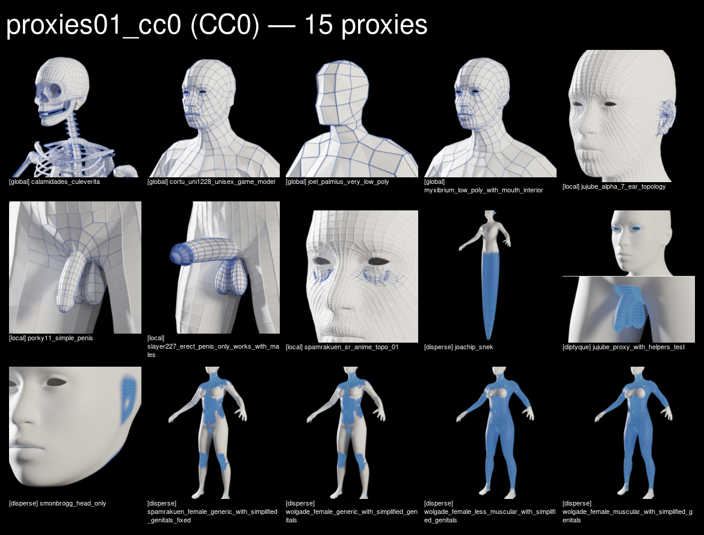
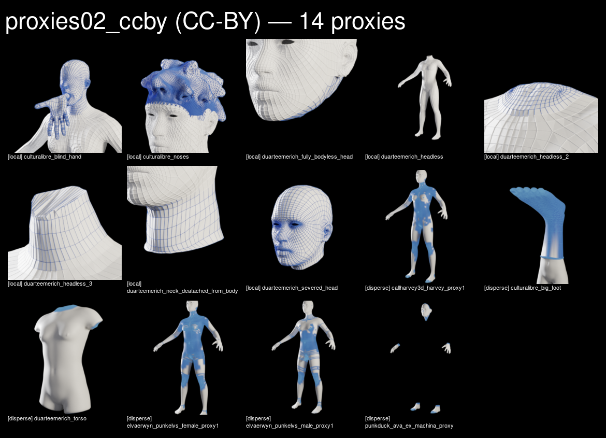
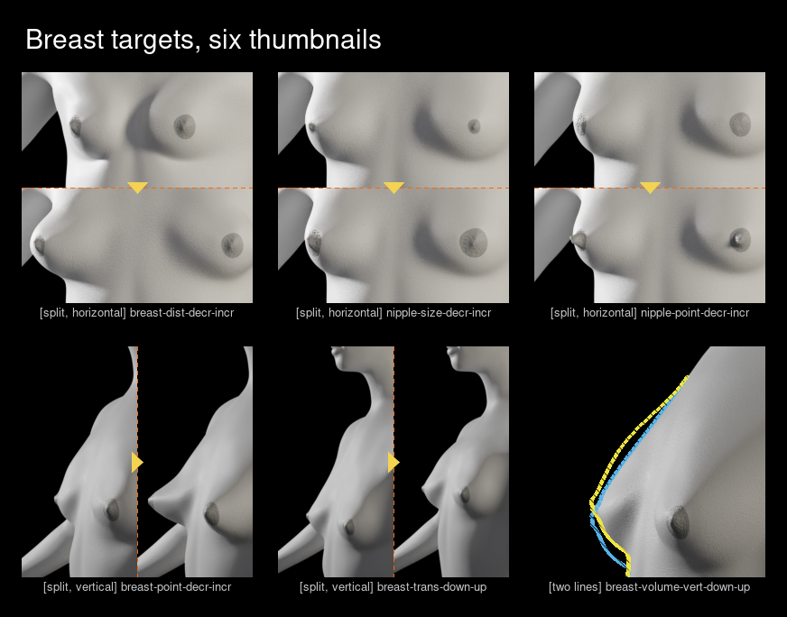

# Thumbnails: contact sheets

Two families, rendered 2026-09-13 in the same studio, on the same opaque black
background.

- [Proxies](#proxy-thumbnails): 29 assets, two packs, `bin/proxies-v2.sh`.
- [Breast targets](#breast-target-thumbnails): 6 sliders, `bin/poitrine.sh`.

## Proxy thumbnails

Rendered with `bin/proxies-v2.sh`. 29 proxies, two packs.

## `proxies01_cc0`, CC0, 15 proxies



## `proxies02_ccby`, CC-BY, 14 proxies



## Measured framing

Three numbers per proxy: **new vertices** (absent from the base mesh),
**clusters** they form, **spread** of those clusters in height.

| regime | test | thumbnail | CC0 | CC-BY |
|---|---|---|---|---|
| **global** | new > 90 % | whole mesh, framed on head and shoulders | 4 | 0 |
| **local** | spread < 35 % | grey mesh, reworked area alone in blue, zoomed | 4 | 7 |
| **spread** | in between | areas painted, framed on their envelope | 7 | 6 |

**The test compares topology, which is what a proxy changes.** It asks whether
each vertex exists in the base mesh. A retopologised ear keeps the shape of the
original one, so the two surfaces overlap and the vertices alone tell them
apart.

## Fixed settings

| | |
|---|---|
| background | black, opaque |
| body | near-white. Neutral by default, **female or male when the asset is sex-specific** (8 of the 29, read from name, title and catalogue category) |
| colour | one blue for everything mesh-related |
| edges | the real mesh edges, so quads stay quads. The Wireframe node would draw the engine's triangulation instead |
| colour blindness | blue keeps its full area under all three forms; the previous orange dropped to 0,01 % under tritanopia |

## Exception

`jujube_proxy_with_helpers_test` changes two areas far apart (pelvis, face).
A single frame serves one or the other, so it is a **stacked diptych**, face
above, anatomy below.

## Regenerate

```
sh bin/proxies-v2.sh <pack> mesurer            # classify
sh bin/proxies-v2.sh <pack> global|local|disperse [assets]
```

Every setting is a command-line option.

---

# Breast target thumbnails

Six sliders, six 256 px squares. Files are in
[`breast-targets/`](breast-targets/), named the way MPFB names slider images:
`<low target>-<high suffix>.png`, as found in `data/targets/_images/`.



## What changed, and what did not

**Camera angles, framing and lighting are unchanged.** They were reviewed in
September and needed no further tweaking, and a measurement confirms the
lighting was already the one the proxies use: the front preset at 25°, the rim
preset at 70°, following the rule that lighting follows the viewing angle.

**Two things changed**, both to match the proxy convention: the background is
now opaque black rather than transparent, which removes the risk of inverted
contrast between light and dark themes, and the body is lighter.

## Why the body is lighter here than on the proxies

The targets sit at `0.68`, the proxies at `0.92`. A proxy body is a
**background** under a blue mesh; a target body is the **subject**, whose shape
has to read. A breast is a curved surface with no edge, so it holds together by
its gradient alone and suffers first from a bright body.

Measured on four levels: modelling drops 13 to 18 % between 0.50 and 0.92 and
mid-tones fall from 95 to 83 %, while the amplitude of the change between the
two ends rises from 27 to 41. The two criteria move in opposite directions, and
0.68 is the only level where both hold: 5 % of modelling lost, 5 to 22 % of
amplitude gained, 99 % of mid-tones.

## Two devices, one rule

| device | when | thumbnails |
|---|---|---|
| **split** | the outline barely moves (below ~5 % of the subject area) | 5 |
| **two lines** | the outline moves | 1 |

The split puts the two ends of the slider in one square, separated by a dotted
line. The two lines device renders the **middle** state and draws both ends over
it as dotted curves, yellow `#F0E442` for the high end, sky blue `#56B4E9` for
the low one. Those two colours come from the Okabe-Ito palette: pink and cyan
read better to the eye and are unusable, their distance dropping from 215 to 55
under simulated deuteranopia. Measured here, the two curves stay 189 to 201
apart in RGB distance under all three forms of colour blindness.

## Regenerate

```
ATELIER=… CIBLES=… sh bin/poitrine.sh clair
ATELIER=… sh bin/assembler-poitrine.sh clair   # composition only, no GPU
```

Replayed from this repository alone in a fresh directory, five of the six come
back within 3 to 23 pixels out of 65 536, and the sixth within 8 199 pixels of
an average amplitude of 0.066 out of 255, its close-up skin grain being denoised
slightly differently each time. One degree of azimuth, by comparison, moves
33 000 to 60 000 pixels.
